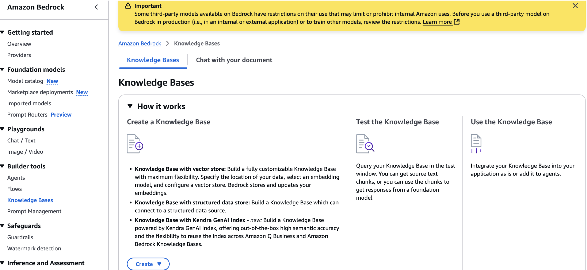
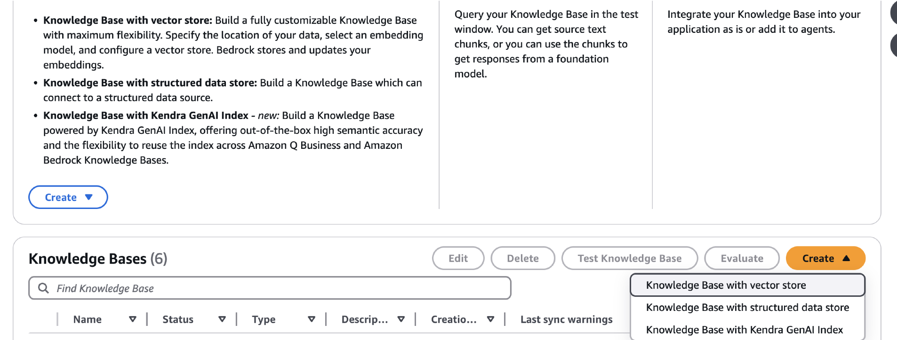
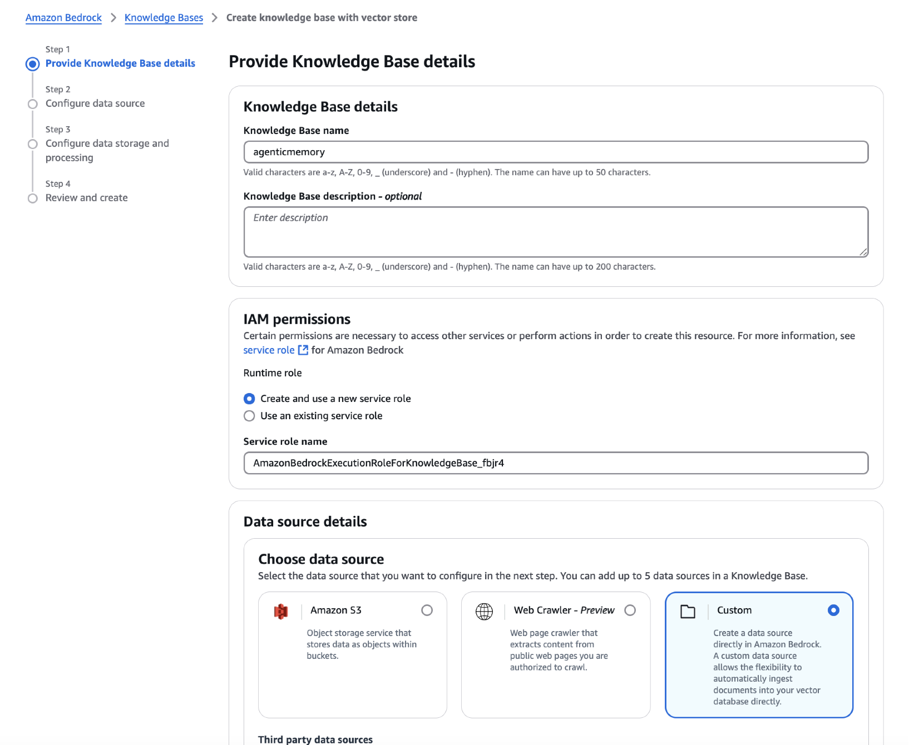
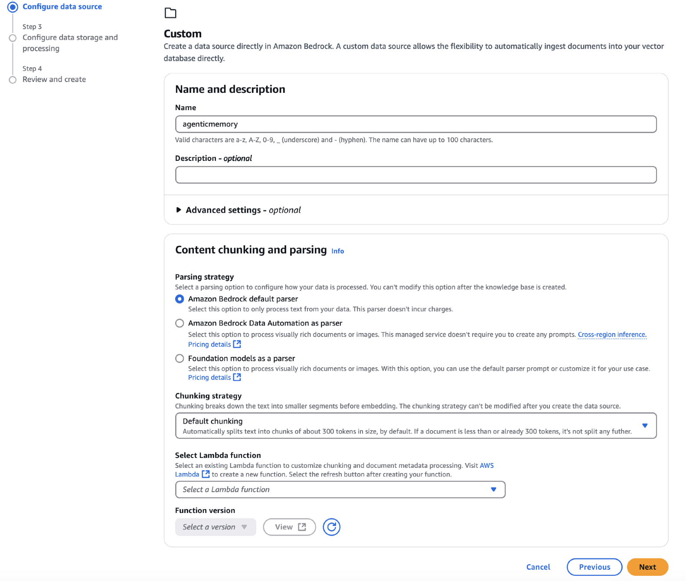
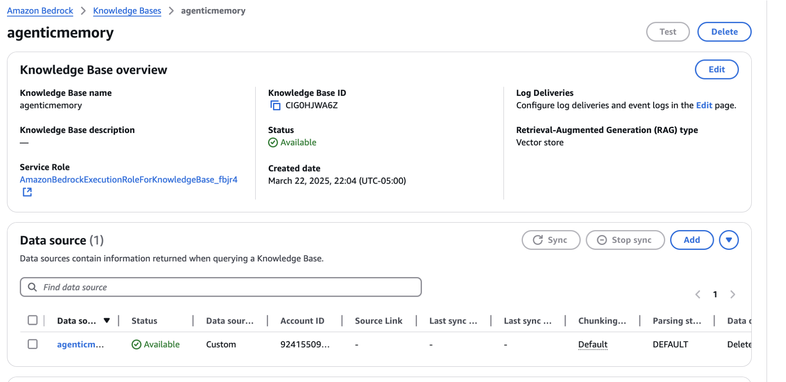
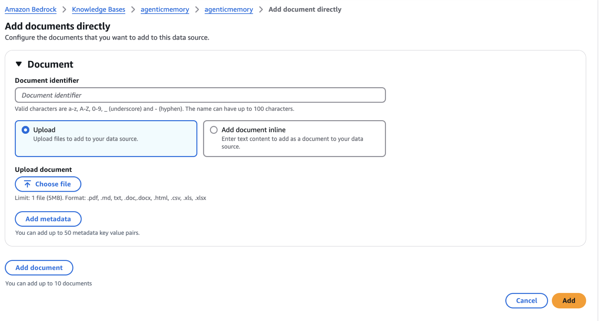
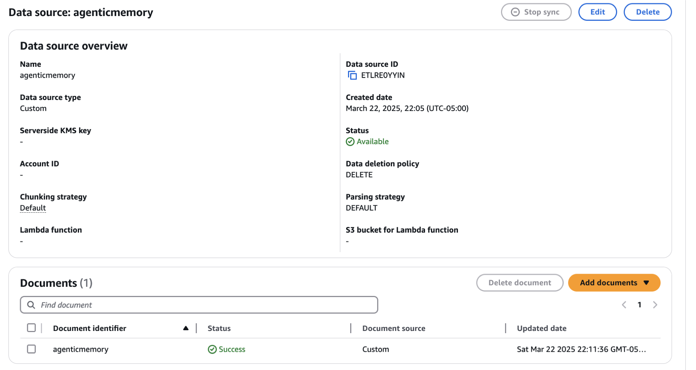
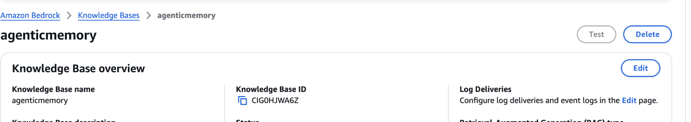

## Create a Knowledge base in Amazon Bedrock

We will be using this knowledge base as langgraph tool throughout the exercise. 
This is a pre-requisite for the labs

Log in to your AWS Account and follow the instructions
You should have access to creating OpenSearch Serverless Collection
You should have access to the Embedding Models in Amazon Bedrock

### 1.  Click on Knowledge Bases

### 2.  Click on "Create" -> "Knowledge Base with Vector Store"

### 3. Provide Knowledge base details
- Give a name to the knowledge base
- for IAM, set the option to Create and use servide role
- Choose "Custom" for Data source
- Clike on "Next"

### 4.  Configure Data Source
- provide a name for the data source
- Keep the rest as default

### 5.  Configure Data storage and processing
- Select the embedding model [in this case Titan Embedding v2]
- Leave the rest as default, vector DB -> Opensearch Serverless

### 6.  Review the details and create the knowledge base

### 7.  Now you need to add the document to the Knowledge base.  
#### - click on the data source name

#### - Upload the agenticmemory.pdf located in the pdf folder

- 

### 8.  Get the Knowledge base Id
- You will be using this knowledge base as a langgraph agent
- enter the knowledge base id in the .env file

