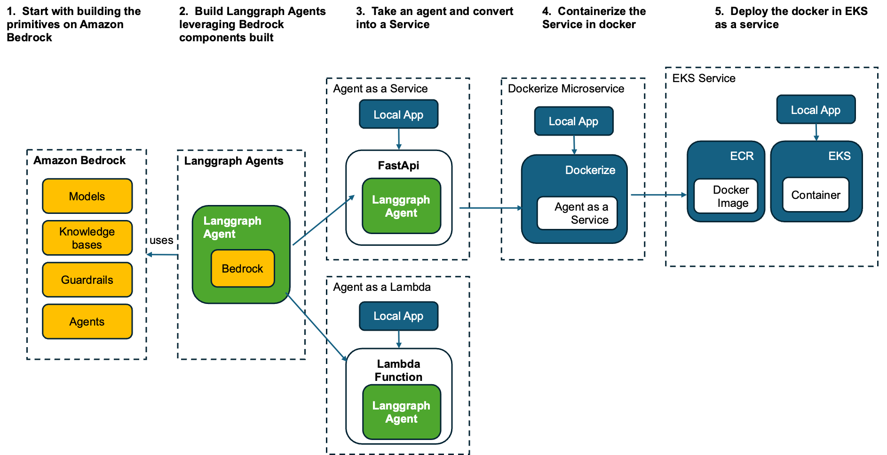

# Langgraph with Amazon Bedrock

Learning langgraph agents patterns and using it with Amazon Bedrock - Models, Knowledge bases and Agents 

## Prerequisites

- AWS Account with appropriate permissions
- Python 3.x
- Git

## Setup Instructions

1.  Rename env.tmp to .env
2.  Update the .env file with your credentials:

AWS_REGION=your_region
TAVILY_API_KEY="Create an Tavily API key by logging in to tavily"
MODEL_ID = "bedrock model id to use"
AWS_REGION="AWS region to use"
BEDROCK_KB_ID="Bedrock knowledge base ID createed in set up instructions
BEDROCK_AGENT_ID = 
BEDROCK_AGENT_ALIAS_ID =

### 1. Create Agent Primitives with Amazon Bedock
- In this section, we will build primitives (Models, Tools, Knowledge Bases, Guradrails and Agents) using Amazon Bedrock
- Navigate to the `bedrock_resources` folder
- Run the notebooks to create the resources that will be leveraged by the Langgrpah Agentic Worklows in the next section

### 2. Build Agent Workflows using Langgraph
- In this section, we will build multiple langgraph agentic workflows 
- These workflows integrate with Amazon Bedrock resources including multi agent orchestration leveraging Amazon Bedrock Agents

### 3.  Langgraph Agent as a Microservice
- In this section, we will now convert the langgraph agent in to a Microservice by wrapping it in fastapi
- We will also create a streamlit application to access the microservice

### 4.  Deploy Langgraph Agent Microservice in EKS
- In this section, we will deploy the agent microservice in EKS

### 5.  Deploy Langgraph Agent Microservice in Lambda
- This section is work in progress......

### Project Structure

project/
├── bedrock_resources/    # Primitives using Amazon Bedrock
└── langgraph_agents      # Langraph Agentic workflow
├── agent_microservice    # Agent as a service
├── dependencies/         # Project dependencies
└── langgraph_agents 

